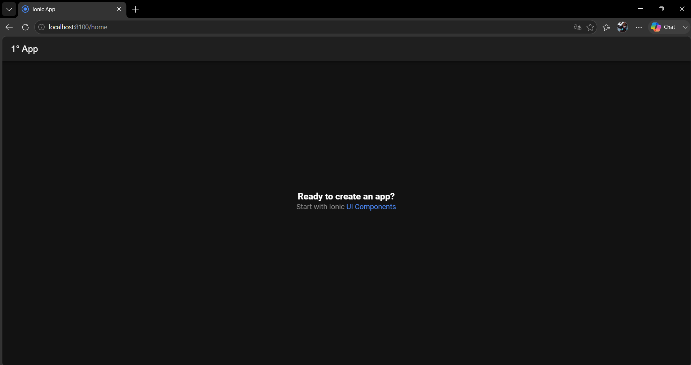

# Semana 6 · Monta tu entorno y crea tu primer proyecto

**Asignatura:** Programación Móvil
**Nombre:** Juan Camilo Bernal Gordillo
**Usuario de GitHub:** JuanBernalCorhuila

## Descripción

En esta actividad instalé Node.js y el CLI de Ionic, creé un proyecto Ionic React en blanco, lo ejecuté localmente y modifiqué el título de la pantalla inicial.

## Pasos realizados

1. **Instalación de Node.js LTS**
   Verificado con:
   ```bash
   node -v
   npm -v
   ```

2. **Instalación del CLI de Ionic**
   ```bash
   npm install -g @ionic/cli
   ionic --version
   ```

3. **Creación del proyecto**
   ```bash
   ionic start miApp blank --type=react
   ```

4. **Ejecución del proyecto**
   ```bash
   cd miApp
   ionic serve
   ```
   La app se abrió correctamente en `http://localhost:8100`.

5. **Modificación del título de la pantalla inicial**
   Se editó el archivo `src/pages/Home.tsx`, cambiando el texto del `IonTitle` de "Blank" a **"1° App"**.

## Captura de la pantalla inicial modificada



## Estructura del proyecto

```
miApp/
  src/
    pages/        -> pantallas (componentes React)
    components/   -> componentes reutilizables
    App.tsx        -> raíz y rutas
  package.json     -> dependencias y scripts
  ionic.config.json
```


