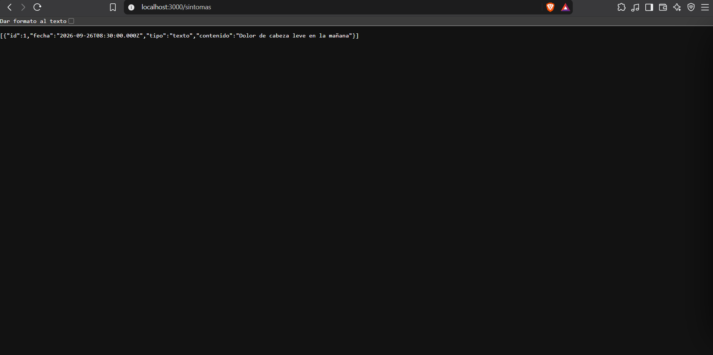
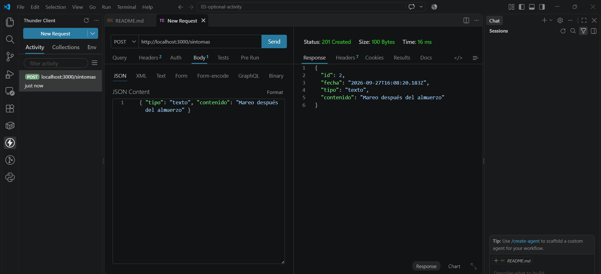
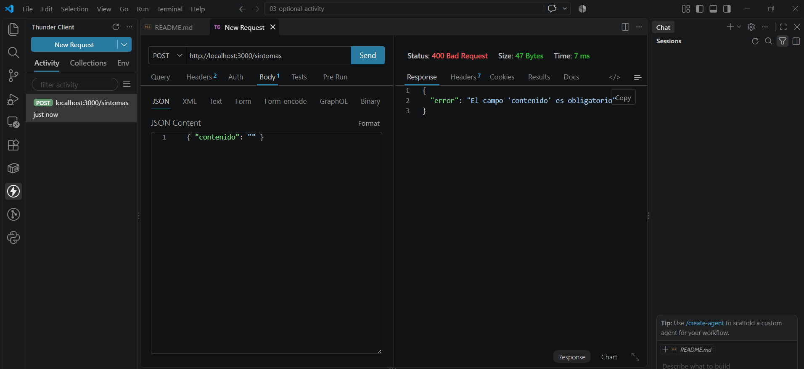
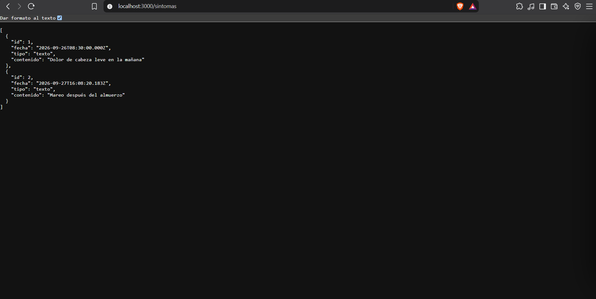
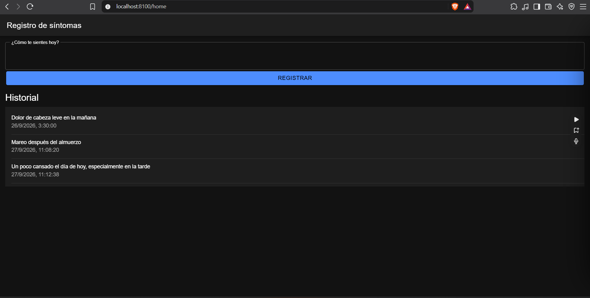
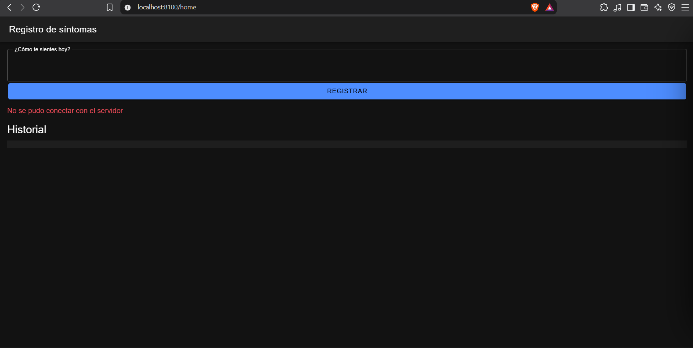

# Semana 8 · API REST con Express y consumo desde la app

**Asignatura:** Programación Móvil
**Nombre:** Juan Camilo Bernal Gordillo
**Usuario de GitHub:** JuanBernalCorhuila

## Descripción

Esta semana HelpHealth pasa a tener su propio backend. Se creó una API REST con Node.js y Express para el **registro de síntomas**, y la app Ionic React la consume con `fetch` para listar los síntomas y registrar nuevos.

## ¿Por qué el registro de síntomas?

HelpHealth es el proyecto que se ha trabajado desde la semana 1: una app de accesibilidad para personas con discapacidad motriz, visual o auditiva que gestionan su salud de forma semi-independiente, y para sus cuidadores. Por eso la API se construyó sobre ese mismo proyecto y no sobre una entidad de ejemplo.

- En las semanas 1 y 2 se definió el **registro de síntomas** como una de las tres funciones del MVP (historia **H3**).
- En la semana 3 se convirtió en el requerimiento **RF3**: registrar los síntomas del día guardando la fecha y hora.
- En la semana 4 se modeló la entidad **RegistroSintoma** (`id`, `fecha`, `tipo`, `contenido`) y se decidió guardarla **en el servidor** (no en el dispositivo), porque el cuidador o el médico necesitan consultarlo desde otro dispositivo.
- En la semana 6 se creó el proyecto Ionic React, que es la base de la app de esta carpeta.

Así, la API usa los mismos campos del modelo de datos, el servidor guarda la fecha y hora de cada registro como pide RF3, y la pantalla sigue el wireframe de síntomas de la semana 4: un campo para escribir cómo se siente el usuario y el historial debajo.

## ¿Qué es una API REST?

Una API REST expone recursos (en este caso, los síntomas) por medio de URLs y métodos HTTP. La app le pide datos al servidor y este le responde en formato **JSON**.

| Método | Acción (CRUD) | Ejemplo |
|---|---|---|
| GET | Leer | `GET /sintomas` |
| POST | Crear | `POST /sintomas` |
| PUT | Actualizar | `PUT /sintomas/1` |
| DELETE | Eliminar | `DELETE /sintomas/1` |

En HelpHealth se implementaron **GET** (consultar el historial) y **POST** (registrar un síntoma).

## Estructura

```
08-week/03-optional-activity/
├── api/                        -> backend con Node.js + Express
│   ├── package.json
│   └── server.js               -> endpoints GET y POST /sintomas
├── app/                        -> app Ionic React (basada en el proyecto de la semana 6)
│   └── src/
│       ├── services/
│       │   └── sintomasApi.ts  -> funciones fetch: listarSintomas() y crearSintoma()
│       └── pages/
│           └── Home.tsx        -> pantalla de registro de síntomas
└── capturas/                   -> evidencias de las pruebas
```

## Endpoints

| Método | Ruta | Cuerpo (JSON) | Respuesta |
|---|---|---|---|
| GET | `/sintomas` | — | `200` con la lista de síntomas |
| POST | `/sintomas` | `{ "tipo": "texto", "contenido": "..." }` | `201` con el síntoma creado |
| POST | `/sintomas` sin `contenido` | `{ "contenido": "" }` | `400` con `{ "error": "El campo 'contenido' es obligatorio" }` |

- `express.json()` permite leer el cuerpo JSON de las peticiones (`req.body`).
- `cors()` permite que la app (puerto 8100) haga peticiones a la API (puerto 3000).
- Los datos se guardan en un arreglo en memoria, así que se reinician al apagar el servidor.
- Los síntomas son datos de salud. En esta versión se usan datos de prueba y la API no tiene autenticación; para usarla con usuarios reales habría que agregarla antes de desplegarla.

## Cómo ejecutarlo

**1. API** (en una terminal):

```bash
cd api
npm install
npm start
```

Queda corriendo en `http://localhost:3000`.

**2. App** (en otra terminal, con la API encendida):

```bash
cd app
npm install
ionic serve
```

Se abre en `http://localhost:8100`.

## Pruebas de los endpoints

Los endpoints se probaron con el navegador y con Thunder Client.

### Prueba 1 · GET /sintomas (navegador)

Al abrir `http://localhost:3000/sintomas` la API responde **200 OK** con el síntoma de ejemplo:

```json
[
  { "id": 1, "fecha": "2026-09-26T08:30:00.000Z", "tipo": "texto", "contenido": "Dolor de cabeza leve en la mañana" }
]
```



### Prueba 2 · POST /sintomas (Thunder Client)

Petición `POST http://localhost:3000/sintomas` con el body:

```json
{ "tipo": "texto", "contenido": "Mareo después del almuerzo" }
```

La API responde **201 Created** con el síntoma creado, su `id` y la fecha en que se registró:

```json
{ "id": 2, "fecha": "2026-09-27T16:08:20.183Z", "tipo": "texto", "contenido": "Mareo después del almuerzo" }
```



### Prueba 3 · POST /sintomas sin contenido

Si se envía un registro vacío:

```json
{ "contenido": "" }
```

La API lo rechaza con **400 Bad Request**:

```json
{ "error": "El campo 'contenido' es obligatorio" }
```



### Prueba 4 · GET /sintomas después del POST

Al consultar de nuevo la lista ya aparece el síntoma creado en la prueba 2 (id 2), lo que confirma que el POST sí lo guardó.



## Consumo desde la app (fetch)

En `app/src/services/sintomasApi.ts` están las dos funciones que usa la app:

- **`listarSintomas()`** hace `GET /sintomas` y devuelve la lista.
- **`crearSintoma(contenido)`** hace `POST /sintomas` y envía el JSON con `Content-Type: application/json`.

La app no guarda ni valida los datos por su cuenta: solo los pide y los envía al servidor.

### Manejo de errores

Las dos funciones usan `try/catch` y además revisan `resp.ok`, porque `fetch` **no** lanza error cuando el servidor responde con un código 400 o 500, solo cuando no logra conectarse.

| Caso | Qué pasa | Mensaje que se muestra |
|---|---|---|
| El servidor responde con error (ej. 400) | `resp.ok` es `false` y se lanza un error con el mensaje del servidor | `El campo 'contenido' es obligatorio` |
| El servidor está apagado o no hay red | `fetch` lanza `TypeError` | `No se pudo conectar con el servidor` |

En la pantalla (`Home.tsx`) se muestra un **indicador de carga** (spinner) mientras llega la lista, y los errores aparecen en rojo.

### Pruebas en la app

**Pantalla de registro de síntomas:** el historial se carga desde la API y el síntoma nuevo, registrado desde la app, aparece en la lista.



**Con el servidor apagado:** la app no se cae y muestra el mensaje de error.


