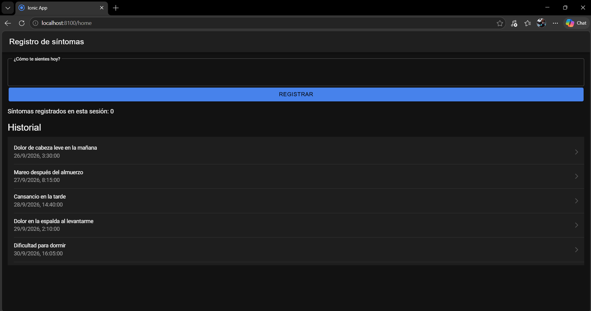
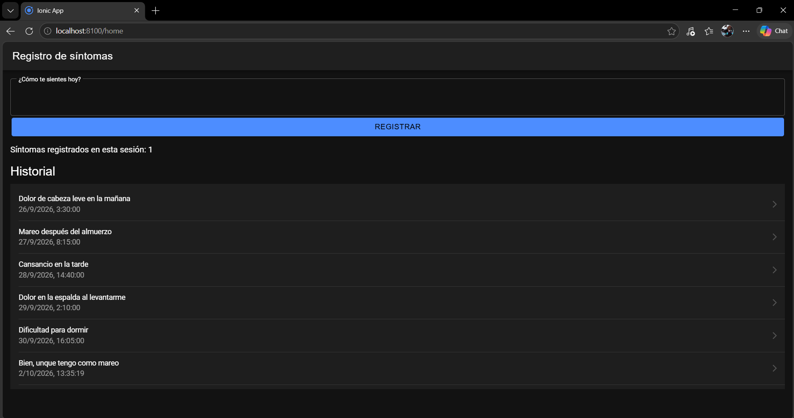
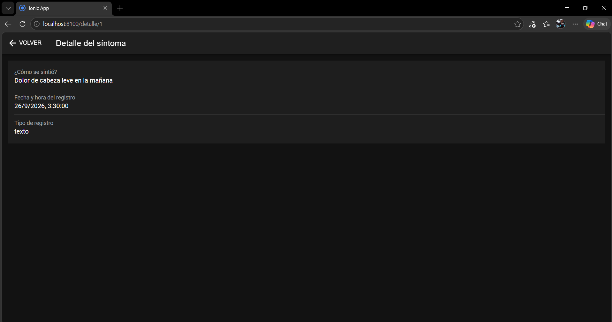

# Semana 9 · Lista de síntomas y navegación al detalle en Ionic React

**Asignatura:** Programación Móvil
**Nombre:** Juan Camilo Bernal Gordillo
**Usuario de GitHub:** JuanBernalCorhuila

## Descripción

Esta semana la pantalla de registro de síntomas de HelpHealth crece a dos páginas. El historial se muestra en una lista hecha con componentes de Ionic React, la pantalla lleva la cuenta de los síntomas que se registran, y al tocar un síntoma se navega a una segunda página con su detalle.

La lista no está escrita en el código de la app: se carga con `fetch` desde la API de HelpHealth que se construyó en la semana 8.

## ¿Por qué el detalle de un síntoma?

El registro de síntomas (historia **H3**) existe para que el usuario o su cuidador puedan mostrarle al médico cómo se ha sentido. En la lista cada registro se ve resumido, así que la segunda página sirve para abrir uno solo y verlo completo, con su fecha y hora, que es el dato que pide el requerimiento **RF3**.

La página de detalle muestra los mismos campos de la entidad **RegistroSintoma** definida en la semana 4 (`contenido`, `fecha`, `tipo`), y se vuelve al historial con el botón de atrás, igual que en el mapa de navegación de esa semana.

## Estructura

```
09-week/03-optional-activity/
├── api/                        -> API de la semana 8 (Node.js + Express)
│   ├── package.json
│   └── server.js               -> GET /sintomas, GET /sintomas/:id y POST /sintomas
├── app/                        -> app Ionic React (continúa la de la semana 8)
│   └── src/
│       ├── App.tsx             -> rutas: /home y /detalle/:id
│       ├── services/
│       │   └── sintomasApi.ts  -> funciones fetch
│       └── pages/
│           ├── Home.tsx        -> lista de síntomas, campo de registro y contador
│           └── Detalle.tsx     -> segunda página: detalle de un síntoma
└── capturas/                   -> evidencias
```

## Qué cambió respecto a la semana 8

| Archivo | Cambio |
|---|---|
| `api/server.js` | Ahora hay 5 síntomas de prueba y un endpoint nuevo, `GET /sintomas/:id`, que devuelve un solo registro (o `404` si no existe). |
| `app/src/services/sintomasApi.ts` | Función nueva `obtenerSintoma(id)` para ese endpoint. |
| `app/src/pages/Home.tsx` | Cada elemento de la lista lleva a su detalle, y se agregó el contador de registros. |
| `app/src/pages/Detalle.tsx` | Página nueva. |
| `app/src/App.tsx` | Ruta nueva `/detalle/:id`. |

## 1. Lista con componentes de Ionic React

El historial se arma con `IonList`, y cada síntoma es un `IonItem` con un `IonLabel` adentro. La lista se recorre con `map`, y cada elemento lleva su `key` (el `id` del síntoma) para que React pueda identificarlo:

```tsx
<IonList>
  {sintomas.map((s) => (
    <IonItem key={s.id} routerLink={`/detalle/${s.id}`} detail>
      <IonLabel>
        <h3>{s.contenido}</h3>
        <p>{new Date(s.fecha).toLocaleString()}</p>
      </IonLabel>
    </IonItem>
  ))}
</IonList>
```

Los 5 síntomas que aparecen al abrir la app son los que devuelve `GET /sintomas`. Se piden una sola vez, cuando la pantalla se abre, con `useEffect`.



## 2. Estado con useState

`useState` guarda datos que cambian; cuando se actualizan, React vuelve a dibujar la pantalla por su cuenta, sin tocar el DOM a mano. En `Home.tsx` se usa para:

| Estado | Qué guarda |
|---|---|
| `sintomas` | La lista que llega de la API. |
| `contenido` | Lo que el usuario va escribiendo en el campo "¿Cómo te sientes hoy?". |
| `registrados` | **Contador** de síntomas registrados desde que se abrió la app. |
| `cargando` y `error` | Si se muestra el indicador de carga o un mensaje de error. |

El contador empieza en 0 y sube en 1 cada vez que un registro se guarda bien:

```tsx
const [registrados, setRegistrados] = useState(0);

async function registrar() {
  await crearSintoma(contenido);
  setContenido('');                  // limpia el campo
  setRegistrados(registrados + 1);   // sube el contador
  cargar();                          // vuelve a pedir la lista
}
```

En pantalla se ve como "Síntomas registrados en esta sesión: 1", y el síntoma nuevo aparece al final de la lista.



## 3. Navegación a la segunda página

Las rutas se definen en `App.tsx` con React Router. Cada ruta dice qué página se muestra:

```tsx
<Route path="/home" element={<Home />} />
<Route path="/detalle/:id" element={<Detalle />} />
```

| Paso | Cómo se hace |
|---|---|
| Ir al detalle | Cada `IonItem` tiene `routerLink="/detalle/<id>"`, así que al tocarlo se navega a esa ruta. |
| Saber qué síntoma mostrar | `Detalle.tsx` lee el `id` de la ruta con `useParams()` y pide ese registro a la API con `obtenerSintoma(id)`. |
| Volver | El `IonBackButton` de la barra superior regresa al historial. |

```
/home (lista)  →  /detalle/3 (detalle del síntoma 3)  →  volver a /home
```



## Cómo ejecutarlo

**1. API** (en una terminal):

```bash
cd api
npm install
npm start
```

Queda corriendo en `http://localhost:3000`.

**2. App** (en otra terminal, con la API encendida):

```bash
cd app
npm install
ionic serve
```

Se abre en `http://localhost:8100`.

Si la API está apagada, la app no se cae: muestra el mensaje "No se pudo conectar con el servidor", tanto en la lista como en el detalle.
