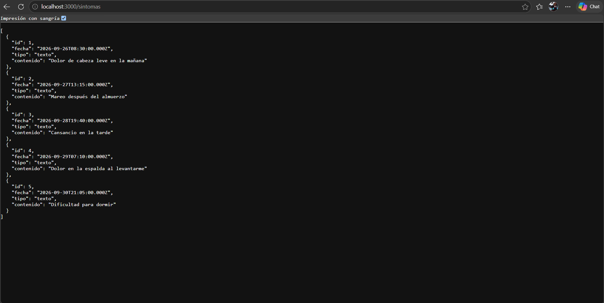
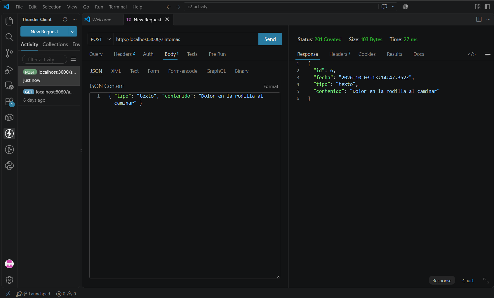
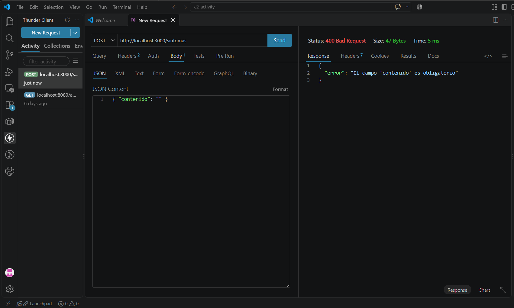
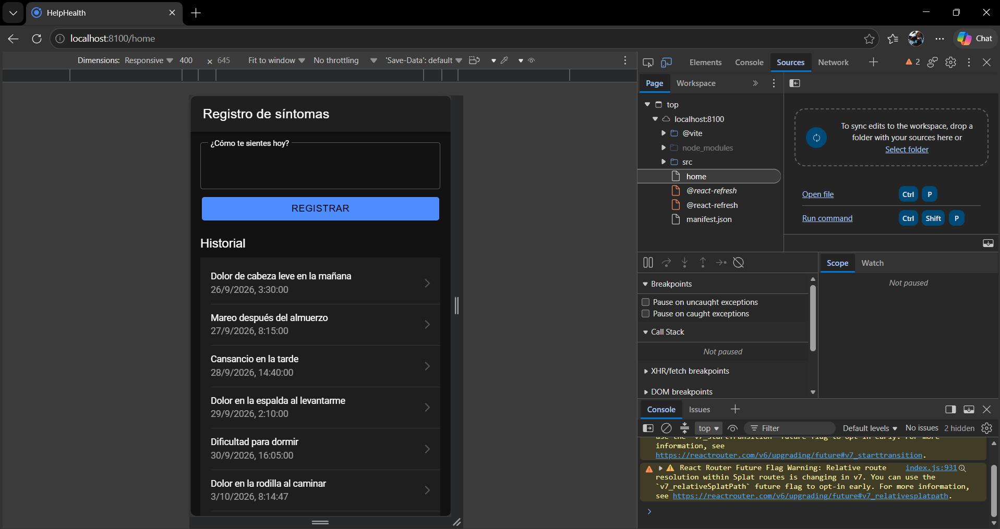
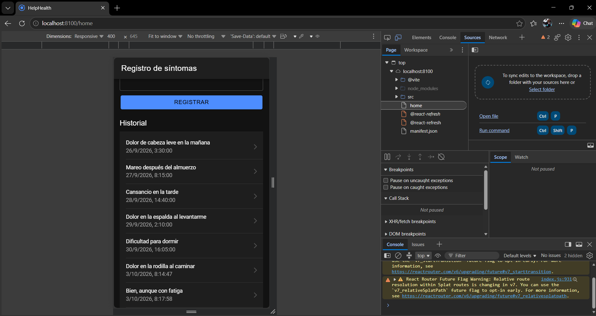
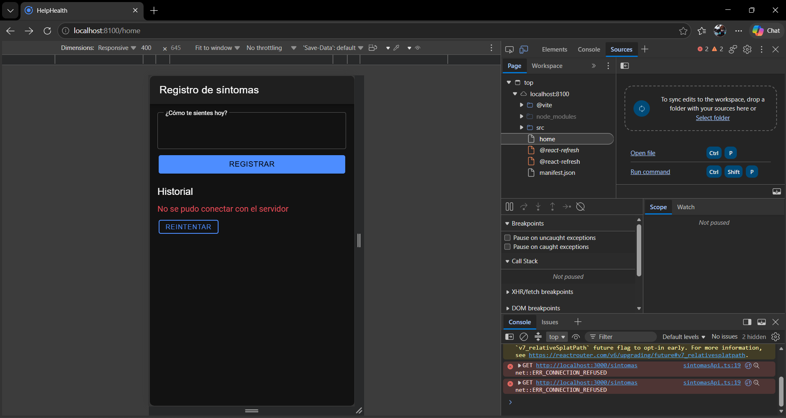
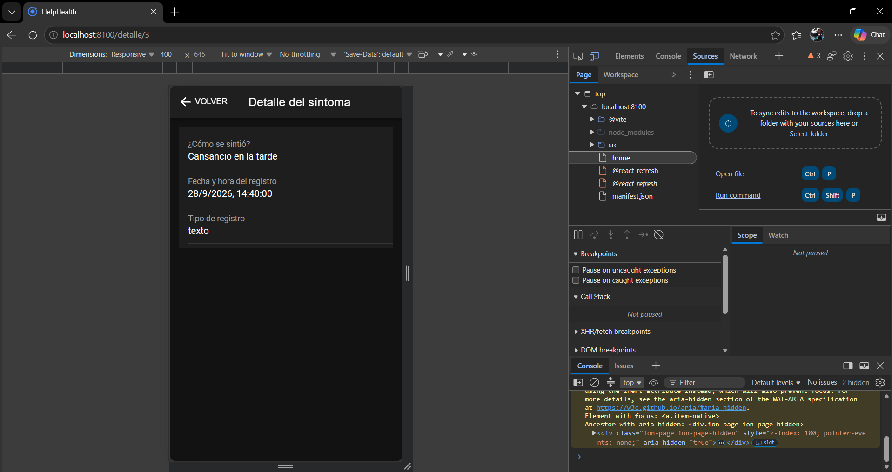

# Corte 2 · HelpHealth: app Ionic React conectada a su API

**Asignatura:** Programación Móvil
**Nombre:** Juan Camilo Bernal Gordillo
**Usuario de GitHub:** JuanBernalCorhuila

## Descripción

Esta entrega reúne en un solo lugar el registro de síntomas de HelpHealth, de punta a punta: una API REST con Express que guarda y entrega los síntomas en JSON, y una app Ionic React que los lista, permite registrar uno nuevo desde un formulario y abre cada registro en una pantalla de detalle.

La app no tiene los datos escritos en el código. Todo lo que muestra lo pide a la API con `fetch`, y si la API no responde, lo dice en pantalla en lugar de quedarse en blanco.

## ¿Por qué el registro de síntomas?

HelpHealth es una app de salud accesible para personas con discapacidad motriz, visual o auditiva y para sus cuidadores. El registro de síntomas es una de las tres funciones de su MVP (historia **H3**, requerimiento **RF3**): el usuario o su cuidador anotan cómo se siente cada día para mostrárselo al médico en la próxima cita.

Se eligió esta función porque es la que el diseño ya ubicaba en el servidor. En el modelo de datos de la semana 4 se definió la entidad **RegistroSintoma** (`id`, `fecha`, `tipo`, `contenido`) y se decidió guardarla de forma remota, porque el cuidador o el médico necesitan consultarla desde otro dispositivo. La API usa esos mismos campos, y la pantalla sigue el wireframe de síntomas: el campo para escribir arriba y el historial debajo.

## Estructura

```
09-week/03-optional-activity/c2-activity/
├── api/                              -> backend con Node.js + Express
│   ├── package.json
│   ├── server.js                     -> configura y enciende el servidor
│   ├── routes/
│   │   └── sintomas.js               -> endpoints GET y POST de /sintomas
│   └── data/
│       └── sintomas.js               -> datos de prueba en memoria
├── app/                              -> app Ionic React
│   └── src/
│       ├── App.tsx                   -> rutas: /home y /detalle/:id
│       ├── services/
│       │   └── sintomasApi.ts        -> todas las llamadas fetch a la API
│       ├── components/
│       │   ├── FormularioSintoma.tsx -> formulario para registrar un síntoma
│       │   ├── FormularioSintoma.css
│       │   ├── ListaSintomas.tsx     -> lista del historial
│       │   ├── MensajeError.tsx      -> mensaje de error con botón "Reintentar"
│       │   └── MensajeError.css
│       └── pages/
│           ├── Home.tsx              -> pantalla principal: formulario + historial
│           ├── Home.css
│           └── Detalle.tsx           -> pantalla de detalle de un síntoma
└── capturas/                         -> evidencias
```

Cada carpeta tiene una sola responsabilidad:

| Carpeta | De qué se encarga |
|---|---|
| `api/routes` | Recibir las peticiones y responder. |
| `api/data` | Guardar los datos. |
| `app/src/services` | Hablar con la API. Es el único lugar de la app donde aparece `fetch`. |
| `app/src/components` | Piezas de interfaz que reciben datos y los muestran. |
| `app/src/pages` | Las pantallas: guardan el estado y juntan los componentes. |

Los estilos están en archivos `.css` aparte, uno por componente o pantalla que lo necesita; no hay estilos escritos dentro de los `.tsx`.

## Architecture

HelpHealth is split into two independent parts: a REST API built with Node.js and Express, and a mobile app built with Ionic React. The API exposes the `RegistroSintoma` entity through three endpoints, and every request and response body is JSON. `GET /sintomas` returns the full list of symptom records with status `200`, and `GET /sintomas/:id` returns a single record, or `404` with an error message if that id does not exist. `POST /sintomas` receives a body like `{ "tipo": "texto", "contenido": "..." }`, lets the server assign the `id` and the date and time, and answers `201` with the new record; if `contenido` is missing or empty, it answers `400` with `{ "error": "..." }`.

The app never calls `fetch` from its screens. All the HTTP calls live in `app/src/services/sintomasApi.ts`, which offers three functions (`listarSintomas`, `obtenerSintoma` and `crearSintoma`), one for each endpoint. The Home page calls `listarSintomas` when it opens and stores the result with `useState`, so React draws the list again whenever that state changes. When the user submits the form, Home calls `crearSintoma` and adds the record returned by the API to the list, which means the app shows exactly what the server saved. Tapping an item navigates to `/detalle/:id`, where the Detail page reads the id from the URL and asks the API for that single record. If the server is down or answers with an error, the service turns the failure into a readable message, and the page shows it together with a retry button instead of crashing.

```
App Ionic React (puerto 8100)                       API Express (puerto 3000)

pages  ->  services/sintomasApi.ts  -- HTTP + JSON -->  routes/sintomas.js  ->  data/sintomas.js
```

## 1. La API

### Endpoints

| Método | Ruta | Cuerpo (JSON) | Respuesta |
|---|---|---|---|
| GET | `/sintomas` | — | `200` con la lista de síntomas |
| GET | `/sintomas/:id` | — | `200` con un síntoma, o `404` con `{ "error": "Síntoma no encontrado" }` |
| POST | `/sintomas` | `{ "tipo": "texto", "contenido": "..." }` | `201` con el síntoma creado |
| POST | `/sintomas` sin `contenido` | `{ "contenido": "" }` | `400` con `{ "error": "El campo 'contenido' es obligatorio" }` |

### Cómo está organizada

`server.js` solo prepara el servidor y conecta las rutas:

```js
app.use(cors());          // permite que la app (puerto 8100) llame a la API (puerto 3000)
app.use(express.json());  // permite leer el cuerpo JSON de las peticiones

app.use("/sintomas", sintomasRoutes);
```

Los endpoints están en `routes/sintomas.js`. El `POST` revisa el dato antes de guardarlo, y es el servidor quien pone el `id` y la fecha y hora del registro:

```js
router.post("/", (req, res) => {
  const { tipo, contenido } = req.body;

  if (typeof contenido !== "string" || contenido.trim() === "") {
    return res.status(400).json({ error: "El campo 'contenido' es obligatorio" });
  }

  const nuevo = {
    id: sintomas.length + 1,
    fecha: new Date().toISOString(),
    tipo: tipo || "texto",
    contenido: contenido.trim(),
  };

  sintomas.push(nuevo);
  res.status(201).json(nuevo);
});
```

Los datos viven en un arreglo en memoria (`data/sintomas.js`) con 5 síntomas de prueba, así que se reinician al apagar el servidor. Son datos de salud: en esta versión son de prueba y la API no tiene autenticación; habría que agregarla antes de usarla con personas reales.

### Pruebas de la API

**GET /sintomas** en el navegador (`http://localhost:3000/sintomas`): responde `200` con los 5 síntomas de prueba.



**POST /sintomas** en Thunder Client, con el body `{ "tipo": "texto", "contenido": "Dolor en la rodilla al caminar" }`: responde `201 Created` con el síntoma creado, su `id` y la fecha.



**POST /sintomas sin contenido**, con el body `{ "contenido": "" }`: la API lo rechaza con `400 Bad Request`.



## 2. La app

### Listar

`Home.tsx` pide el historial una sola vez, cuando la pantalla se abre, y lo guarda en el estado:

```tsx
const [sintomas, setSintomas] = useState<Sintoma[]>([]);

useEffect(() => {
  cargar();
}, []);
```

`ListaSintomas.tsx` recibe esa lista y la dibuja con `IonList`. Cada elemento lleva su `key` y un `routerLink` hacia su detalle:

```tsx
{sintomas.map((s) => (
  <IonItem key={s.id} routerLink={`/detalle/${s.id}`} detail>
    <IonLabel>
      <h3>{s.contenido}</h3>
      <p>{new Date(s.fecha).toLocaleString()}</p>
    </IonLabel>
  </IonItem>
))}
```



### Crear

`FormularioSintoma.tsx` es un `<form>` con el campo "¿Cómo te sientes hoy?" y el botón Registrar. Al enviarlo, `Home` manda el texto a la API y agrega a la lista el registro que la API devuelve:

```tsx
async function registrar(contenido: string): Promise<boolean> {
  setErrorRegistro('');
  try {
    const nuevo = await crearSintoma(contenido);
    setSintomas([...sintomas, nuevo]);
    return true;
  } catch (e) {
    setErrorRegistro((e as Error).message);
    return false;
  }
}
```

Como la lista está en `useState`, al actualizarla React vuelve a dibujar el historial y el síntoma nuevo aparece al final sin recargar la página. El campo solo se limpia si el registro se guardó; si falló, el texto se conserva para no tener que escribirlo otra vez.



### Estado con useState

| Estado | Dónde | Qué guarda |
|---|---|---|
| `sintomas` | `Home` | La lista que llega de la API. |
| `cargando` | `Home` y `Detalle` | Si se muestra el indicador de carga. |
| `errorLista` y `errorRegistro` | `Home` | El mensaje de error al cargar el historial o al registrar. |
| `contenido` y `enviando` | `FormularioSintoma` | Lo que el usuario escribe y si el registro se está enviando. |
| `sintoma` y `error` | `Detalle` | El registro que se está viendo y el error al pedirlo. |

## 3. Manejo de errores

Hay dos formas en que una petición puede fallar, y `fetch` solo avisa de una: lanza un error cuando no logra conectarse, pero **no** cuando el servidor responde con un código 400, 404 o 500. Por eso la función `pedir` de `sintomasApi.ts` revisa las dos:

```ts
async function pedir<T>(ruta: string, opciones?: RequestInit): Promise<T> {
  let resp: Response;
  try {
    resp = await fetch(`${API_URL}${ruta}`, opciones);
  } catch {
    throw new Error('No se pudo conectar con el servidor');
  }

  const datos = await resp.json().catch(() => ({}));
  if (!resp.ok) {
    throw new Error(datos.error || `Error del servidor (${resp.status})`);
  }
  return datos;
}
```

Las tres funciones del servicio usan `pedir`, así que el manejo de errores está escrito una sola vez. Las pantallas lo reciben con `try/catch` y lo guardan en el estado para mostrarlo con `MensajeError`.

| Caso | Mensaje que se muestra |
|---|---|
| La API está apagada o no hay red | `No se pudo conectar con el servidor`, con el botón **Reintentar** |
| Se envía el formulario vacío (la API responde `400`) | `El campo 'contenido' es obligatorio` |
| Se abre el detalle de un id que no existe (la API responde `404`) | `Síntoma no encontrado` |

Mientras llega la respuesta se muestra un indicador de carga (`IonSpinner`).



## 4. Navegación al detalle

Las rutas están en `App.tsx`:

```tsx
<Route path="/home" element={<Home />} />
<Route path="/detalle/:id" element={<Detalle />} />
```

| Paso | Cómo se hace |
|---|---|
| Ir al detalle | Cada `IonItem` de la lista tiene `routerLink="/detalle/<id>"`. |
| Saber qué síntoma mostrar | `Detalle.tsx` lee el `id` de la ruta con `useParams()` y lo pide con `obtenerSintoma(id)`. |
| Volver | El `IonBackButton` de la barra superior regresa al historial. |

```
/home (formulario + historial)  →  /detalle/3 (síntoma 3)  →  volver a /home
```

La pantalla de detalle muestra los campos de **RegistroSintoma**: cómo se sintió el usuario, la fecha y hora del registro y el tipo.



## Cómo ejecutarlo

**1. API** (en una terminal):

```bash
cd api
npm install
npm start
```

Queda corriendo en `http://localhost:3000`.

**2. App** (en otra terminal, con la API encendida):

```bash
cd app
npm install
ionic serve
```

Se abre en `http://localhost:8100`.
