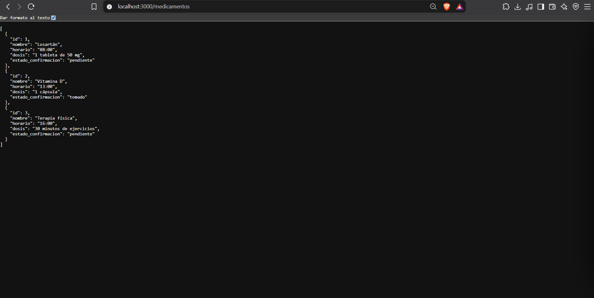
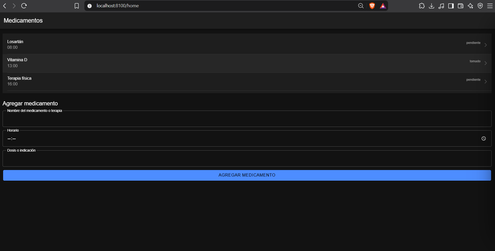
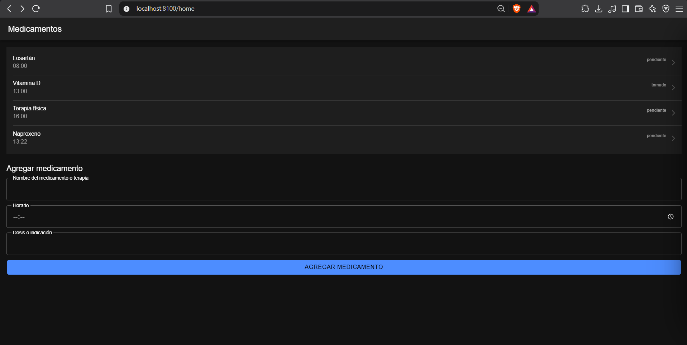
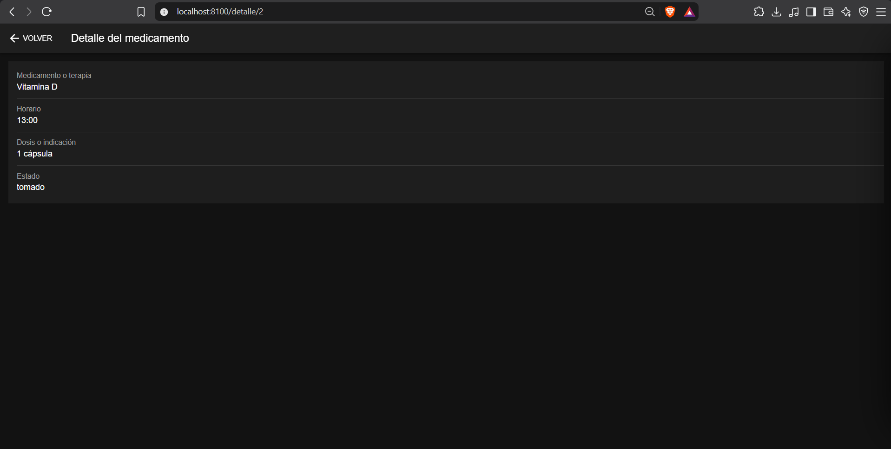
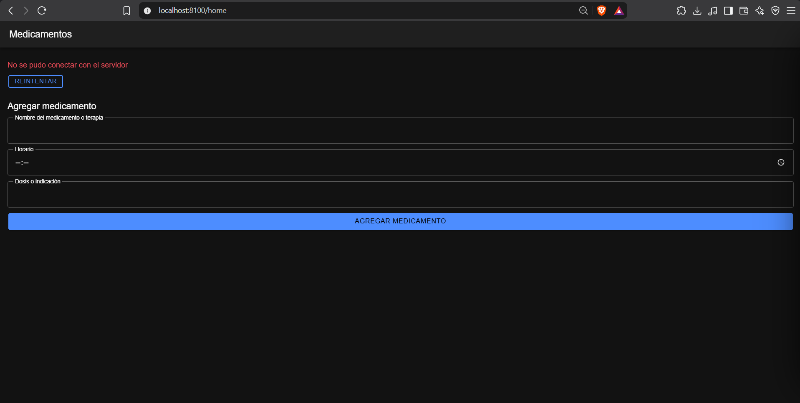

# Semana 10 · HelpHealth: mini-app integradora del Corte 2

**Asignatura:** Programación Móvil
**Nombre:** Juan Camilo Bernal Gordillo
**Usuario de GitHub:** JuanBernalCorhuila

## Descripción

Para cerrar el Corte 2 se construyó la pantalla de **medicamentos** de HelpHealth funcionando de punta a punta: una API con Node.js y Express que guarda y entrega los medicamentos en JSON, y una app Ionic React que los lista, agrega uno nuevo desde un formulario y abre cada uno en una pantalla de detalle.

En las semanas 8 y 9 se había trabajado el registro de síntomas. Esta vez se tomó la otra pantalla del diseño, usando lo mismo que se aprendió en el corte: el proyecto Ionic de la semana 6, una API REST como la de la semana 8 y los componentes, el estado y las rutas de la semana 9.

## ¿Por qué los medicamentos?

HelpHealth es una app de salud accesible para personas con discapacidad motriz, visual o auditiva y para sus cuidadores. Recordar los medicamentos y las terapias es la primera función de su MVP (historia **H1**, requerimiento **RF1**), y para poder recordarlos primero hay que tenerlos registrados con su horario.

La mini-app usa la entidad **Medicamento** tal como quedó en el modelo de datos de la semana 4 (`id`, `nombre`, `horario`, `dosis`, `estado_confirmacion`) y sigue el wireframe de esa pantalla: la lista con el horario y el estado de cada medicamento, y debajo la opción de agregar uno nuevo. Los datos de prueba son los mismos del wireframe: Losartán, Vitamina D y Terapia física.

En el diseño, los medicamentos se guardan en el dispositivo para que los recordatorios funcionen sin conexión, y se sincronizan después. Esta API representa esa copia en el servidor, que es la que le permite al cuidador consultar los medicamentos desde otro dispositivo (historia **H5**). Guardarlos también en el teléfono queda para cuando se vea almacenamiento local.

## Estructura

```
10-week/03-optional-activity/
├── api/                                  -> backend con Node.js + Express
│   ├── package.json
│   ├── server.js                         -> configura y enciende el servidor
│   ├── routes/
│   │   └── medicamentos.js               -> endpoints GET y POST de /medicamentos
│   └── data/
│       └── medicamentos.js               -> datos de prueba en memoria
├── app/                                  -> app Ionic React
│   └── src/
│       ├── App.tsx                       -> rutas: /home y /detalle/:id
│       ├── services/
│       │   └── medicamentosApi.ts        -> todas las llamadas fetch a la API
│       ├── components/
│       │   ├── ListaMedicamentos.tsx     -> lista de medicamentos
│       │   ├── FormularioMedicamento.tsx -> formulario para agregar un medicamento
│       │   ├── FormularioMedicamento.css
│       │   ├── MensajeError.tsx          -> mensaje de error con botón "Reintentar"
│       │   └── MensajeError.css
│       └── pages/
│           ├── Home.tsx                  -> pantalla principal: lista + formulario
│           ├── Home.css
│           └── Detalle.tsx               -> pantalla de detalle de un medicamento
└── capturas/                             -> evidencias
```

Cada carpeta tiene una sola responsabilidad: `api/routes` recibe las peticiones y responde, `api/data` guarda los datos, `app/src/services` es el único lugar de la app donde aparece `fetch`, `app/src/components` son piezas de interfaz que reciben datos y los muestran, y `app/src/pages` son las pantallas, que guardan el estado y juntan los componentes. Los estilos van en archivos `.css` aparte.

## Cómo se comunican la app y la API

```
App Ionic React (puerto 8100)                            API Express (puerto 3000)

pages  ->  services/medicamentosApi.ts  -- HTTP + JSON -->  routes/medicamentos.js  ->  data/medicamentos.js
```

La app no tiene ningún medicamento escrito en el código. Cada vez que necesita datos se los pide a la API con `fetch`, la API responde en JSON y la pantalla guarda esa respuesta en su estado para dibujarla.

## 1. El backend

La API expone la entidad **Medicamento** con estos endpoints:

| Método | Ruta | Cuerpo (JSON) | Respuesta |
|---|---|---|---|
| GET | `/medicamentos` | — | `200` con la lista de medicamentos |
| GET | `/medicamentos/:id` | — | `200` con un medicamento, o `404` con `{ "error": "Medicamento no encontrado" }` |
| POST | `/medicamentos` | `{ "nombre": "...", "horario": "20:00", "dosis": "..." }` | `201` con el medicamento creado |
| POST | `/medicamentos` con un campo vacío | `{ "nombre": "" }` | `400` con `{ "error": "El nombre, el horario y la dosis son obligatorios" }` |

`server.js` solo prepara el servidor y conecta las rutas:

```js
app.use(cors());          // permite que la app (puerto 8100) llame a la API (puerto 3000)
app.use(express.json());  // permite leer el cuerpo JSON de las peticiones

app.use("/medicamentos", medicamentosRoutes);
```

Los endpoints están en `routes/medicamentos.js`. El `GET` devuelve el arreglo completo y el `POST` revisa los datos antes de guardarlos. El servidor es quien pone el `id` y el estado: todo medicamento nuevo empieza como `pendiente`.

```js
router.get("/", (req, res) => {
  res.json(medicamentos);
});

router.post("/", (req, res) => {
  const { nombre, horario, dosis } = req.body;

  if (!esTextoValido(nombre) || !esTextoValido(horario) || !esTextoValido(dosis)) {
    return res.status(400).json({ error: "El nombre, el horario y la dosis son obligatorios" });
  }

  const nuevo = {
    id: medicamentos.length + 1,
    nombre: nombre.trim(),
    horario: horario.trim(),
    dosis: dosis.trim(),
    estado_confirmacion: "pendiente",
  };

  medicamentos.push(nuevo);
  res.status(201).json(nuevo);
});
```

El `GET /medicamentos/:id` existe porque la pantalla de detalle pide a la API el medicamento que va a mostrar. Los datos viven en un arreglo en memoria (`data/medicamentos.js`), así que se reinician al apagar el servidor.



## 2. Listar los medicamentos

`Home.tsx` pide la lista una sola vez, cuando la pantalla se abre, y la guarda en el estado:

```tsx
const [medicamentos, setMedicamentos] = useState<Medicamento[]>([]);

useEffect(() => {
  cargar();
}, []);
```

`ListaMedicamentos.tsx` recibe esa lista y la dibuja con `IonList`. Cada elemento muestra el nombre, el horario y el estado, lleva su `key` y tiene un `routerLink` hacia su detalle:

```tsx
{medicamentos.map((m) => (
  <IonItem key={m.id} routerLink={`/detalle/${m.id}`} detail>
    <IonLabel>
      <h3>{m.nombre}</h3>
      <p>{m.horario}</p>
    </IonLabel>
    <IonNote slot="end">{m.estado_confirmacion}</IonNote>
  </IonItem>
))}
```



## 3. Agregar un medicamento desde el formulario

`FormularioMedicamento.tsx` es un `<form>` con tres campos (nombre, horario y dosis) y el botón "Agregar medicamento". Cada campo guarda lo que el usuario escribe en su propio `useState`. Al enviarlo, `Home` manda los datos a la API y agrega a la lista el medicamento que la API devuelve:

```tsx
async function agregar(medicamento: NuevoMedicamento): Promise<boolean> {
  setErrorFormulario('');
  try {
    const nuevo = await crearMedicamento(medicamento);
    setMedicamentos([...medicamentos, nuevo]);
    return true;
  } catch (e) {
    setErrorFormulario((e as Error).message);
    return false;
  }
}
```

Como la lista está en `useState`, al actualizarla React vuelve a dibujarla y el medicamento nuevo aparece al final sin recargar la página. Los campos solo se limpian si el medicamento se guardó; si falló, lo escrito se conserva para no tener que escribirlo otra vez.



## 4. Navegación al detalle

Las rutas están en `App.tsx`:

```tsx
<Route path="/home" element={<Home />} />
<Route path="/detalle/:id" element={<Detalle />} />
```

| Paso | Cómo se hace |
|---|---|
| Ir al detalle | Cada `IonItem` de la lista tiene `routerLink="/detalle/<id>"`. |
| Saber qué medicamento mostrar | `Detalle.tsx` lee el `id` de la ruta con `useParams()` y lo pide con `obtenerMedicamento(id)`. |
| Volver | El `IonBackButton` de la barra superior regresa a la lista. |

La pantalla de detalle muestra los campos de **Medicamento**: el nombre, el horario, la dosis o indicación y el estado.



## 5. Manejo de errores de red

Una petición puede fallar de dos formas, y `fetch` solo avisa de una: lanza un error cuando no logra conectarse, pero **no** cuando el servidor responde con un código 400, 404 o 500. Por eso la función `pedir` de `medicamentosApi.ts` revisa las dos:

```ts
async function pedir<T>(ruta: string, opciones?: RequestInit): Promise<T> {
  let resp: Response;
  try {
    resp = await fetch(`${API_URL}${ruta}`, opciones);
  } catch {
    throw new Error('No se pudo conectar con el servidor');
  }

  const datos = await resp.json().catch(() => ({}));
  if (!resp.ok) {
    throw new Error(datos.error || `Error del servidor (${resp.status})`);
  }
  return datos;
}
```

Las tres funciones del servicio usan `pedir`, así que el manejo de errores está escrito una sola vez. Las pantallas lo reciben con `try/catch`, lo guardan en el estado y lo muestran con el componente `MensajeError`.

| Caso | Qué ve el usuario |
|---|---|
| La API está apagada o no hay red | `No se pudo conectar con el servidor`, con el botón **Reintentar** |
| Se envía el formulario con un campo vacío (la API responde `400`) | `El nombre, el horario y la dosis son obligatorios` |
| Se abre el detalle de un id que no existe (la API responde `404`) | `Medicamento no encontrado` |

Mientras llega la respuesta se muestra un indicador de carga (`IonSpinner`), para que la pantalla nunca quede en blanco.



## Cómo ejecutarlo

**1. API** (en una terminal):

```bash
cd api
npm install
npm start
```

Queda corriendo en `http://localhost:3000`.

**2. App** (en otra terminal, con la API encendida):

```bash
cd app
npm install
ionic serve
```

Se abre en `http://localhost:8100`.
